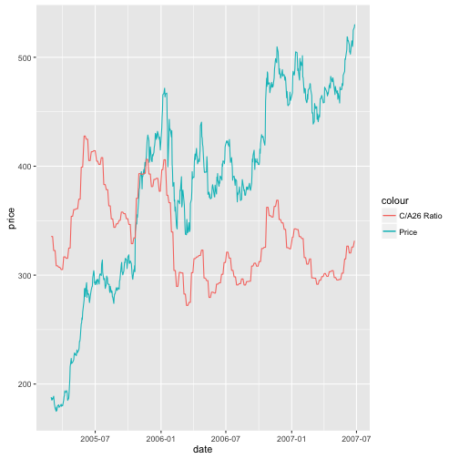
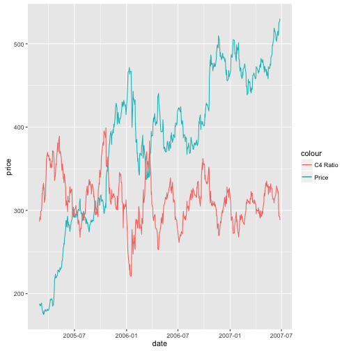
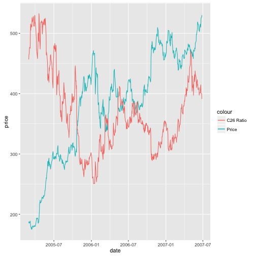

Relative Strength as a Criterion for Investment Selection
========================================================
author: David Loughborough and Liam Moorfield-Yee
date: May 9, 2016

Introduction
========================================================

- Written by Robert A. Levy in 1967.
- Attempts to find a relationship between a stocks past and future performance.
- Groups stocks into deciles based on how they have performed in the past 26 weeks.

C/A26 Ratio
========================================================

- Historical ratio used to rank and group stocks.
- The current weeks' avergae price divided by the prior 26 week rolling price average.

C4 Ratio
========================================================

- Short term performance indicator.
- Takes a stocks price 4 weeks in the future and divdes that by the current price.
- All prices are taken on Friday or the latest trading day of that week.

C26 Ratio
========================================================

- Medium term performance indicator.
- Takes a stocks price 26 weeks in the future and divides that by the current price.
- All prices are taken on Friday or latest trading day of that week.

